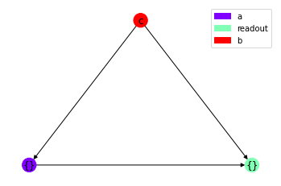
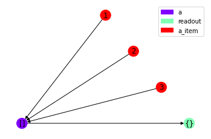

# 调参教程
all2graph的模型参数主要分为四块：<br>
1、DataParser参数<br>
2、MetaInfo参数<br>
3、RawGraphParser参数<br>
4、网络结构参数<br>

我们从效果和使用两个角度来初步衡量一下参数的特性：<br>
1、在效果方面，4的影响最大，1其次，2和3的影响可能局限于数据集<br>
2、在使用方面，1的参数只能在DataParser构造的时候传入，2和3可以在构造Factory的时候传入，4可以在Factory.produce_model传入


```python
import all2graph as ag
import pandas as pd
```

    all2graph: version=0.4.3
    Using backend: pytorch
    all2graph: cython compiled


## 1. DataParser参数
这部分参数主要改变图结构

### dict_degree: 默认1，自然数，插入dict时跳连前置节点的度数，0表示全部
增大参数能增加图的复杂度，能提高拟合程度，同时增大内存占用，减慢训练速度


```python
data1 = {'a': {'b': 'c'}}
df1 = pd.DataFrame({'timestamp': [None], 'data': [data1]})
```


```python
parser3 = ag.JsonParser(
    json_col='data',
    time_col='timestamp',
    dict_degree=0
)
graph3 = parser3(df1)
graph3.draw()
```


    (<Figure size 432x288 with 1 Axes>, <AxesSubplot:>)


    

    


### list_degree: 默认1，自然数，插入list时跳连前置节点的度数，0表示全部
增大参数能增加图的复杂度，能提高拟合程度，同时增大内存占用，减慢训练速度


```python
data2 = {'a': [1, 2, 3]}
df2 = pd.DataFrame({'timestamp': [None], 'data': [data2]})
```


```python
parser4 = ag.JsonParser(
    json_col='data',
    time_col='timestamp',
)
graph4 = parser4(df2)
graph4.draw()
```


    (<Figure size 432x288 with 1 Axes>, <AxesSubplot:>)


    

    


```python
parser5 = ag.JsonParser(
    json_col='data',
    time_col='timestamp',
    list_degree=0
)
graph5 = parser5(df2)
graph5.draw()
```


    (<Figure size 432x288 with 1 Axes>, <AxesSubplot:>)


    

    


## 2. MetaInfo参数
这部分参数主要影响元数据，从而影响数据的归一化
### num_bins: 统计数据分布时分箱的数量，默认None，即不分箱
数据的归一化是根据分布来进行的，减少分箱会1）降低分布精度；2）对数据进行截尾<br>
适当的分箱能增强模型的稳定性和泛化能力，但是过度的分箱会产生信息损失，从而造成模型效果下降


```python
meta_info = ag.MetaInfo.from_data(graph5, num_bins=10)
meta_info
```


    MetaInfo(num_types=3, num_numbers=1, num_tokens=0)


## 3. RawGraphParser参数
这部分参数控制归一化和转化成dgl.Graph的流程
### tokenizer: 会自动给key分词
### min_df: 字符串最小文档频率，小于这个值的字符串会被转换成None
### max_df: 字符串最大文档频率，大于这个值的字符串会被转换成None
### scale_method: 'prob' or 'minmax_scale'
对数值型做归一化的方法，prob表示按照概率归一化，minmax_scale表示minmax归一化<br>
归一化所使用的分布和统计值，均来自MetaInfo，因此会受到MetaInfo参数的影响


```python
class Tokenizer:
    @staticmethod
    def lcut(x):
        return x


graph_parser = ag.GraphParser.from_data(meta_info, min_df=0, max_df=1, tokenizer=Tokenizer())
graph_parser
```


    GraphParser(num_tokens=13, num_numbers=1, scale_method=prob, scale_kwargs={})


## 4. 网络结构参数
参数有很多，建议先调大参数，再调小参数
### d_model: 整数，模型隐藏层神经元数量
数值越大，模型表征能力越强，同时参数量按O(n^2)上升，计算时间按照O(n^3)上升
### nhead：整数，而且必须是d_model的因数，注意力机head数量
数值越大，模型表征能力增强，参数量和计算量几乎不变
### num_layers：整数数组，例如[1, 2, 3] ，数组长度表示模型block数量，每个数表示这个block里的隐藏层数
block越多，模型表征能力越强，参数量和计算量按照O(n)上升<br>
block内的隐藏层共享参数，因此只会增加计算量，几乎不会影响参数量，增大时能增加模型表征能力
### seq_degree: 会增加序列关联节点的边的数量


```python
model = ag.nn.GATFM(
    d_model=8,
    num_layers=6,
    num_heads=2,
    seq_degree=(10, 10),
    data_parser=parser5,
    graph_parser=graph_parser, # optional
    check_point='check_point'
)
```
